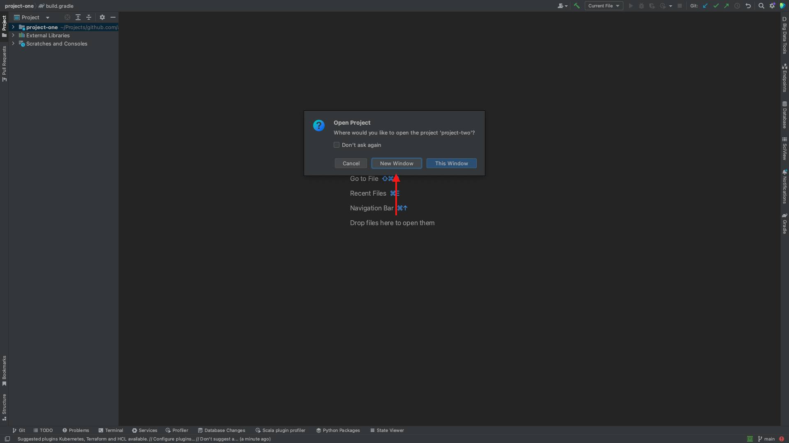

# IntelliJ Big Data Bug


## Reproduce

### Download and Run Zeppelin

```shell
wget https://dlcdn.apache.org/zeppelin/zeppelin-0.10.1/zeppelin-0.10.1-bin-all.tgz
tar zxf zeppelin-0.10.1-bin-all.tgz
./zeppelin-0.10.1-bin-all/bin/zeppelin-daemon.sh start
```

### Clone Repo and Run IDE

```shell
git clone git@github.com:kevinsewell/intellij-bigdata-bug.git
cd intellij-bigdata-bug
./gradlew runIde
```

### Open Example Project One

<p align="center">

</p>

<p align="center">

</p>

### Open Example Project Two

<p align="center">

</p>

<p align="center">

</p>

<p align="center">

</p>

### Add Python SDK

<p align="center">

</p>

<p align="center">

</p>

<p align="center">

</p>

<p align="center">

</p>

### Add Python Facet to Project Two

<p align="center">

</p>

<p align="center">

</p>

### Add Zeppelin Connection

<p align="center">

</p>

<p align="center">

</p>

### Create and Open Zeppelin Notebook

<p align="center">

</p>

<p align="center">

</p>

### Close - Open - Close Example Project Two

<p align="center">

</p>

<p align="center">

</p>

<p align="center">

</p>

<p align="center">

</p>

### Behold the Exceptions

<p align="center">

</p>

#### Exceptions

<details>
<summary><b>SymbolicIdAlreadyExistsException</b></summary>

```
   addEntity: symbolic id already exists. Replacing entity with the new one.
Symbolic id: FacetId(name=Python for Zeppelin, type=Python, parentId=ModuleId(name=Zeppelin@ZeppelinConnections@3463125466496525364))

Existing entity data: FacetEntityData(name=Python for Zeppelin, moduleId=ModuleId(name=Zeppelin@ZeppelinConnections@3463125466496525364), facetType=Python, configurationXmlTag=<configuration sdkName="Python 3.9 (project-two)" />, entitySource=com.intellij.workspaceModel.ide.NonPersistentEntitySource@72b8e733, id=0, id=0)
New entity data: FacetEntityData(name=Python for Zeppelin, moduleId=ModuleId(name=Zeppelin@ZeppelinConnections@3463125466496525364), facetType=Python, configurationXmlTag=<configuration sdkName="Python 3.9 (project-two)" />, entitySource=com.intellij.workspaceModel.ide.NonPersistentEntitySource@72b8e733, id=-1, id=-1)

Broken consistency: false
   
   com.intellij.platform.workspace.storage.impl.exceptions.SymbolicIdAlreadyExistsException: Entity with symbolicId: FacetId(name=Python for Zeppelin, type=Python, parentId=ModuleId(name=Zeppelin@ZeppelinConnections@3463125466496525364)) already exist
	at com.intellij.platform.workspace.storage.impl.MutableEntityStorageImpl.assertUniqueSymbolicId(EntityStorageSnapshotImpl.kt:272)
	at com.intellij.platform.workspace.storage.impl.MutableEntityStorageImpl.putEntity(EntityStorageSnapshotImpl.kt:238)
	at com.intellij.platform.workspace.storage.impl.ModifiableWorkspaceEntityBase.addToBuilder(Entities.kt:420)
	at com.intellij.platform.workspace.jps.entities.FacetEntityImpl$Builder.applyToBuilder(FacetEntityImpl.kt:82)
	at com.intellij.platform.workspace.storage.impl.MutableEntityStorageImpl.addEntity(EntityStorageSnapshotImpl.kt:218)
	at com.intellij.workspaceModel.ide.impl.legacyBridge.facet.ModifiableFacetModelBridgeImpl.addFacet(ModifiableFacetModelBridgeImpl.kt:66)
	at com.intellij.workspaceModel.ide.impl.legacyBridge.facet.ModifiableFacetModelBridgeImpl.addFacet(ModifiableFacetModelBridgeImpl.kt:44)
	at com.intellij.bigdatatools.zeppelin.notebook.interpreter.supported.python.ZeppelinPythonDependencyResolver.addFacetInner$lambda$2(ZeppelinPythonDependencyResolver.kt:179)
	at com.intellij.openapi.project.DumbServiceImpl.smartInvokeLater$lambda$16(DumbServiceImpl.kt:405)
	at com.intellij.util.concurrency.ContextRunnable.run(ContextRunnable.java:24)
	at com.intellij.openapi.application.TransactionGuardImpl.runWithWritingAllowed(TransactionGuardImpl.java:208)
	at com.intellij.openapi.application.TransactionGuardImpl.access$100(TransactionGuardImpl.java:21)
	at com.intellij.openapi.application.TransactionGuardImpl$1.run(TransactionGuardImpl.java:190)
	at com.intellij.openapi.application.impl.ApplicationImpl.runIntendedWriteActionOnCurrentThread(ApplicationImpl.java:861)
	at com.intellij.openapi.application.impl.ApplicationImpl$4.run(ApplicationImpl.java:478)
	at com.intellij.openapi.application.impl.FlushQueue.doRun(FlushQueue.java:79)
	at com.intellij.openapi.application.impl.FlushQueue.runNextEvent(FlushQueue.java:121)
	at com.intellij.openapi.application.impl.FlushQueue.flushNow(FlushQueue.java:41)
	at java.desktop/java.awt.event.InvocationEvent.dispatch(InvocationEvent.java:318)
	at java.desktop/java.awt.EventQueue.dispatchEventImpl(EventQueue.java:792)
	at java.desktop/java.awt.EventQueue$3.run(EventQueue.java:739)
	at java.desktop/java.awt.EventQueue$3.run(EventQueue.java:733)
	at java.base/java.security.AccessController.doPrivileged(AccessController.java:399)
	at java.base/java.security.ProtectionDomain$JavaSecurityAccessImpl.doIntersectionPrivilege(ProtectionDomain.java:86)
	at java.desktop/java.awt.EventQueue.dispatchEvent(EventQueue.java:761)
	at com.intellij.ide.IdeEventQueue.defaultDispatchEvent(IdeEventQueue.kt:685)
	at com.intellij.ide.IdeEventQueue._dispatchEvent$lambda$10(IdeEventQueue.kt:589)
	at com.intellij.openapi.application.impl.ApplicationImpl.runWithoutImplicitRead(ApplicationImpl.java:1485)
	at com.intellij.ide.IdeEventQueue._dispatchEvent(IdeEventQueue.kt:589)
	at com.intellij.ide.IdeEventQueue.access$_dispatchEvent(IdeEventQueue.kt:67)
	at com.intellij.ide.IdeEventQueue$dispatchEvent$processEventRunnable$1$1$1.compute(IdeEventQueue.kt:369)
	at com.intellij.ide.IdeEventQueue$dispatchEvent$processEventRunnable$1$1$1.compute(IdeEventQueue.kt:368)
	at com.intellij.openapi.progress.impl.CoreProgressManager.computePrioritized(CoreProgressManager.java:787)
	at com.intellij.ide.IdeEventQueue$dispatchEvent$processEventRunnable$1$1.invoke(IdeEventQueue.kt:368)
	at com.intellij.ide.IdeEventQueue$dispatchEvent$processEventRunnable$1$1.invoke(IdeEventQueue.kt:363)
	at com.intellij.ide.IdeEventQueueKt.performActivity$lambda$1(IdeEventQueue.kt:992)
	at com.intellij.openapi.application.TransactionGuardImpl.performActivity(TransactionGuardImpl.java:105)
	at com.intellij.ide.IdeEventQueueKt.performActivity(IdeEventQueue.kt:992)
	at com.intellij.ide.IdeEventQueue.dispatchEvent$lambda$7(IdeEventQueue.kt:363)
	at com.intellij.openapi.application.impl.ApplicationImpl.runIntendedWriteActionOnCurrentThread(ApplicationImpl.java:861)
	at com.intellij.ide.IdeEventQueue.dispatchEvent(IdeEventQueue.kt:405)
	at java.desktop/java.awt.EventDispatchThread.pumpOneEventForFilters(EventDispatchThread.java:207)
	at java.desktop/java.awt.EventDispatchThread.pumpEventsForFilter(EventDispatchThread.java:128)
	at java.desktop/java.awt.EventDispatchThread.pumpEventsForHierarchy(EventDispatchThread.java:117)
	at java.desktop/java.awt.EventDispatchThread.pumpEvents(EventDispatchThread.java:113)
	at java.desktop/java.awt.EventDispatchThread.pumpEvents(EventDispatchThread.java:105)
	at java.desktop/java.awt.EventDispatchThread.run(EventDispatchThread.java:92)

```

</details>

<details>
<summary><b>AlreadyDisposedException</b></summary>
```
com.intellij.serviceContainer.AlreadyDisposedException: Cannot create com.intellij.ide.util.PropertiesComponent because container is already disposed (container=Project(name=project-two, containerState=DISPOSE_COMPLETED, componentStore=/Users/kevin/Projects/github.com/aronim/intellij-bigdata-gradle-bug/examples/project-two) (disposed))
	at com.intellij.serviceContainer.ContainerUtilKt.throwAlreadyDisposedError(containerUtil.kt:40)
	at com.intellij.serviceContainer.ComponentManagerImpl.doGetService(ComponentManagerImpl.kt:698)
	at com.intellij.serviceContainer.ComponentManagerImpl.getService(ComponentManagerImpl.kt:630)
	at com.intellij.ide.util.PropertiesComponent.getInstance(PropertiesComponent.java:88)
	at com.intellij.bigdatatools.zeppelin.notebook.interpreter.supported.python.ZeppelinPythonDependencyResolver$1.projectClosingBeforeSave(ZeppelinPythonDependencyResolver.kt:102)
	at com.intellij.util.messages.impl.MessageBusImplKt.invokeMethod(MessageBusImpl.kt:699)
	at com.intellij.util.messages.impl.MessageBusImplKt.invokeListener(MessageBusImpl.kt:659)
	at com.intellij.util.messages.impl.MessageBusImplKt.executeOrAddToQueue(MessageBusImpl.kt:491)
	at com.intellij.util.messages.impl.ToDirectChildrenMessagePublisher.publish$intellij_platform_core(CompositeMessageBus.kt:279)
	at com.intellij.util.messages.impl.MessagePublisher.invoke(MessageBusImpl.kt:448)
	at jdk.proxy2/jdk.proxy2.$Proxy93.projectClosingBeforeSave(Unknown Source)
	at com.intellij.openapi.project.impl.ProjectManagerImpl.closeProject(ProjectManagerImpl.kt:366)
	at com.intellij.openapi.project.impl.ProjectManagerImpl.closeProject$default(ProjectManagerImpl.kt:317)
	at com.intellij.openapi.project.impl.ProjectManagerImpl.closeAndDispose(ProjectManagerImpl.kt:417)
	at com.intellij.openapi.wm.impl.CloseProjectWindowHelper.closeProjectAndShowWelcomeFrameIfNoProjectOpened(CloseProjectWindowHelper.kt:57)
	at com.intellij.openapi.wm.impl.CloseProjectWindowHelper.windowClosing(CloseProjectWindowHelper.kt:44)
	at com.intellij.openapi.wm.impl.ProjectFrameHelper.windowClosing(ProjectFrameHelper.kt:439)
	at com.intellij.openapi.wm.impl.WindowCloseListener.windowClosing(ProjectFrameHelper.kt:459)
	at java.desktop/java.awt.AWTEventMulticaster.windowClosing(AWTEventMulticaster.java:357)
	at java.desktop/java.awt.AWTEventMulticaster.windowClosing(AWTEventMulticaster.java:357)
	at java.desktop/java.awt.AWTEventMulticaster.windowClosing(AWTEventMulticaster.java:357)
	at java.desktop/java.awt.Window.processWindowEvent(Window.java:2113)
	at java.desktop/javax.swing.JFrame.processWindowEvent(JFrame.java:298)
	at java.desktop/java.awt.Window.processEvent(Window.java:2072)
	at java.desktop/java.awt.Component.dispatchEventImpl(Component.java:5027)
	at java.desktop/java.awt.Container.dispatchEventImpl(Container.java:2324)
	at java.desktop/java.awt.Window.dispatchEventImpl(Window.java:2808)
	at java.desktop/java.awt.Component.dispatchEvent(Component.java:4855)
	at java.desktop/java.awt.EventQueue.dispatchEventImpl(EventQueue.java:794)
	at java.desktop/java.awt.EventQueue$3.run(EventQueue.java:739)
	at java.desktop/java.awt.EventQueue$3.run(EventQueue.java:733)
	at java.base/java.security.AccessController.doPrivileged(AccessController.java:399)
	at java.base/java.security.ProtectionDomain$JavaSecurityAccessImpl.doIntersectionPrivilege(ProtectionDomain.java:86)
	at java.base/java.security.ProtectionDomain$JavaSecurityAccessImpl.doIntersectionPrivilege(ProtectionDomain.java:97)
	at java.desktop/java.awt.EventQueue$4.run(EventQueue.java:766)
	at java.desktop/java.awt.EventQueue$4.run(EventQueue.java:764)
	at java.base/java.security.AccessController.doPrivileged(AccessController.java:399)
	at java.base/java.security.ProtectionDomain$JavaSecurityAccessImpl.doIntersectionPrivilege(ProtectionDomain.java:86)
	at java.desktop/java.awt.EventQueue.dispatchEvent(EventQueue.java:763)
	at com.intellij.ide.IdeEventQueue.defaultDispatchEvent(IdeEventQueue.kt:685)
	at com.intellij.ide.IdeEventQueue._dispatchEvent$lambda$10(IdeEventQueue.kt:589)
	at com.intellij.openapi.application.impl.ApplicationImpl.runWithoutImplicitRead(ApplicationImpl.java:1485)
	at com.intellij.ide.IdeEventQueue._dispatchEvent(IdeEventQueue.kt:589)
	at com.intellij.ide.IdeEventQueue.access$_dispatchEvent(IdeEventQueue.kt:67)
	at com.intellij.ide.IdeEventQueue$dispatchEvent$processEventRunnable$1$1$1.compute(IdeEventQueue.kt:369)
	at com.intellij.ide.IdeEventQueue$dispatchEvent$processEventRunnable$1$1$1.compute(IdeEventQueue.kt:368)
	at com.intellij.openapi.progress.impl.CoreProgressManager.computePrioritized(CoreProgressManager.java:787)
	at com.intellij.ide.IdeEventQueue$dispatchEvent$processEventRunnable$1$1.invoke(IdeEventQueue.kt:368)
	at com.intellij.ide.IdeEventQueue$dispatchEvent$processEventRunnable$1$1.invoke(IdeEventQueue.kt:363)
	at com.intellij.ide.IdeEventQueueKt.performActivity$lambda$1(IdeEventQueue.kt:992)
	at com.intellij.openapi.application.TransactionGuardImpl.performActivity(TransactionGuardImpl.java:113)
	at com.intellij.ide.IdeEventQueueKt.performActivity(IdeEventQueue.kt:992)
	at com.intellij.ide.IdeEventQueue.dispatchEvent$lambda$7(IdeEventQueue.kt:363)
	at com.intellij.openapi.application.impl.ApplicationImpl.runIntendedWriteActionOnCurrentThread(ApplicationImpl.java:861)
	at com.intellij.ide.IdeEventQueue.dispatchEvent(IdeEventQueue.kt:405)
	at java.desktop/java.awt.EventDispatchThread.pumpOneEventForFilters(EventDispatchThread.java:207)
	at java.desktop/java.awt.EventDispatchThread.pumpEventsForFilter(EventDispatchThread.java:128)
	at java.desktop/java.awt.EventDispatchThread.pumpEventsForHierarchy(EventDispatchThread.java:117)
	at java.desktop/java.awt.EventDispatchThread.pumpEvents(EventDispatchThread.java:113)
	at java.desktop/java.awt.EventDispatchThread.pumpEvents(EventDispatchThread.java:105)
	at java.desktop/java.awt.EventDispatchThread.run(EventDispatchThread.java:92)

```
</details>
